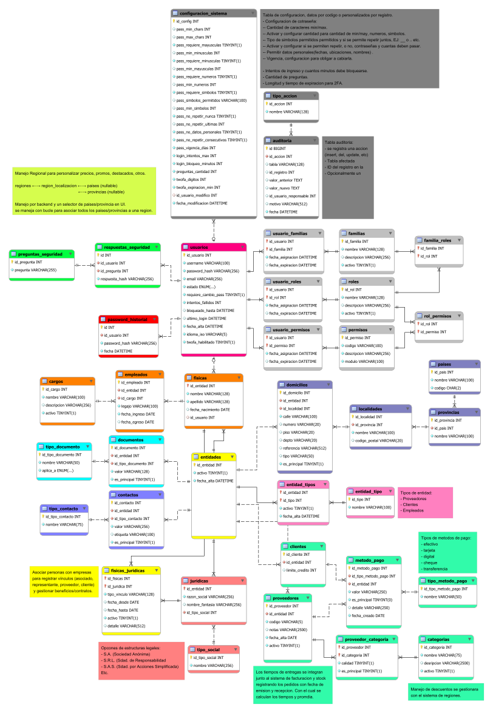

# Database

## Estructura
```
database/
│
├── schema/                         # Scripts SQL para importar DB
│   ├── 01_schema.sql                  # Estructura de la base de datos
│   ├── 02_views.sql                   # Consultas reutilizables
│   ├── 03_routines.sql                # Store Procedures
│   ├── 04_triggers.sql                # auditorias automaticas
│   ├── 05_seed_data.sql               # Datos iniciales
│   ├── 06_full_schema.sql             # Estructura completa de la base de datos
│   ├── schema-mysql-23-05-2026.sql
│   └── schema-sqlserver-23-05-2026.sql
│
├── script/                         # Scripts para ajustes de assets.
│   ├── background-svg.py              # Coloca un fondo blanco a los SVGs
│   ├── recorte-svg.py.py              # Recorta los SVGs
│   └── processed_files.txt            # Guarda el nombre del archivo para ignorar los ya procesados.
│
├── migrations/                     # Cambios incrementales en DB
│   ├── aaaammddhhmmss_migration.sql   # Cambios incrementales
│   └── ...
│
├── assets/                         # Recursos visuales (diagrama EER)
│   └── aaaammdd.png/svg           # Diagrama EER de la base de datos
│
├── apps/                           # Instalador MySQL Workbench
│   └── mysql-workbench-community-8.0.42-winx64.msi  
│
├── 7mo2da-gonzalito.mwb               # Modelo visual (MySQL Workbench)
├── .gitignore                         # Ignora archivos no necesarios
└── README.md                          # Documentación
```

> [!WARNING] Requisitos
> SQL Server 2019 (Management Studio) ─ [win64](https://github.com/TheEnterpriseOrg/sqlserver2019.git)
> SQL Server Configuration Manager ─ [win64](https://github.com/TheEnterpriseOrg/sqlserver2019.git)
> MySQL version 8.0.x (Workbench/Community) ─ [win64](./apps/mysql-workbench-community-8.0.42-winx64.msi)  

## Convenciones de los scripts
- `01_schema.sql` comienza limpiando la base con `DROP TABLE IF EXISTS` en orden inverso de dependencias.
- Luego se recrean las tablas y constraints.
- Para `views`, `stored procedures` y `triggers` se usará `OR ALTER` para reemplazar objetos si ya existen.
- El objetivo es poder ejecutar los scripts de forma repetible sin conflictos por objetos previos.

## Nota sobre los archivos históricos
- `schema-mysql-23-05-2026.sql` corresponde al esquema viejo en MySQL.
- `schema-sqlserver-23-05-2026.sql` corresponde a la migración/conversión a SQL Server.
- Se conservan por nombre y fecha como respaldo histórico.

## Orden de ejecución
### SQL Server
1. Click derecho en `databases`
2. Seleccionar `New Database...`
3. Colocar nombre `theEnterprise7mo2da`
4. Click derecho en `theEnterprise7mo2da`
5. Seleccionar `New Query`
6. Copiar y pegar el contenido de `schema/` en orden:
   - `01_schema.sql`
   - `02_views.sql`
   - `03_store_procedures.sql`
   - `04_triggers.sql`
   - `05_seed_data.sql`

### MySQL
1. Instalar MySQL v8.0.x 
2. Panel izquierdo -> **Models**
3. Abrir `7mo2da-gonzalito.mwb`

## Esquema visual
[](./assets/20260520.svg)
> Haz clic en la imagen para abrirla en una pestaña nueva con zoom completo.

---

> [!NOTE]
> - El archivo `.mwb` contiene el diseño visual completo (diagramas EER), Tablas, los triggers, los stored procedures (Routines) y las consultas reutilizables (Views). Este es el archivo maestro para el diseño de la base de datos. Cualquier cambio en la estructura o lógica de la base de datos debe reflejarse en este archivo para mantener la coherencia entre el diseño visual y los scripts SQL, que deberan ser exportados.
> - Los scripts SQL en la carpeta `schema/` son para importar la estructura y lógica de la base de datos local o proveedor. El script `full_schema.sql` es una combinación de todos los scripts individuales (`schema.sql`, `views.sql`, `routines.sql`, `triggers.sql`) para facilitar la importación completa de la base de datos.
> - La carpeta `migrations/` es para scripts SQL que representan cambios incrementales en la base de datos a lo largo del tiempo. Cada archivo de migración debe seguir una convención de nomenclatura que incluya una marca de tiempo para garantizar el orden correcto de ejecución. Estos scripts son útiles para mantener un historial de cambios y facilitar la actualización de la base de datos en diferentes entornos.actualización de la base de datos en diferentes entornos.
> - MySQL queda como referencia de modelado, pero la implementación y ejecución de la base quedan orientadas a SQL Server 2019.
